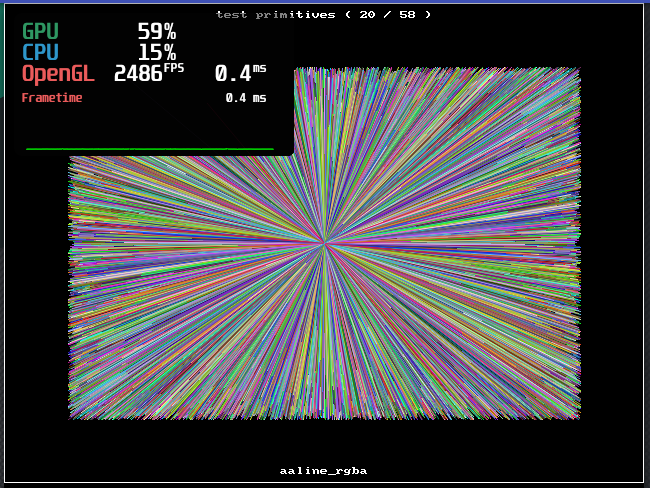

# fortran-sdl2_gfx
Fortran bindings for SDL2_gfx (https://www.ferzkopp.net/Software/SDL2_gfx/Docs/html/index.html) to be used in conjunction with: https://github.com/interkosmos/fortran-sdl2

## fpm build

fpm build

fpm run

## example

See example in the tst folder, that applies each of the gfx primitive functions:

