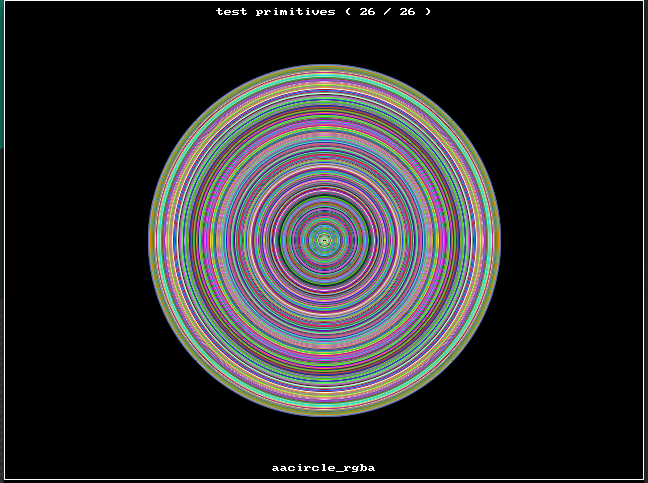

# fortran-sdl2_gfx
Fortran bindings for SDL2_gfx (https://www.ferzkopp.net/Software/SDL2_gfx/Docs/html/index.html) to be used in conjunction with: https://github.com/interkosmos/fortran-sdl2

STILL UNDER HEAVY CONSTRUCTION!!!

## Progress

* Graphic Primitives ✓
* Surface Rotozoomer
* Framerate control
* MMX image filters
* Build-in 8x8 Font
* Documentation
* Example and test

## Build

I build and compile using meson. My fortran-sdl2 library is installed in my ~/.local folder. Set your PKG_CONFIG_PATH accordingly when calling meson.

```bash
[grassy@manjaro fortran-sdl2_gfx]$ rm -rf debug/

[grassy@manjaro fortran-sdl2_gfx]$ PKG_CONFIG_PATH=/home/grassy/.local/lib/pkgconfig meson debug
Using 'PKG_CONFIG_PATH' from environment with value: '/home/grassy/.local/lib/pkgconfig'
Using 'PKG_CONFIG_PATH' from environment with value: '/home/grassy/.local/lib/pkgconfig'
The Meson build system
Version: 0.56.2
Source dir: /home/grassy/fortran/fortran-sdl2_gfx
Build dir: /home/grassy/fortran/fortran-sdl2_gfx/debug
Build type: native build
Project name: fortran-sdl2_gfx
Project version: 0.1.0
Fortran compiler for the host machine: gfortran (gcc 10.2.0 "GNU Fortran (GCC) 10.2.0")
Fortran linker for the host machine: gfortran ld.bfd 2.36
Host machine cpu family: x86_64
Host machine cpu: x86_64
Found pkg-config: /usr/bin/pkg-config (1.7.3)
Using 'PKG_CONFIG_PATH' from environment with value: '/home/grassy/.local/lib/pkgconfig'
Run-time dependency fortran_sdl2 found: YES 1.0.0
Using 'PKG_CONFIG_PATH' from environment with value: '/home/grassy/.local/lib/pkgconfig'
Run-time dependency sdl2 found: YES 2.0.14
Using 'PKG_CONFIG_PATH' from environment with value: '/home/grassy/.local/lib/pkgconfig'
Run-time dependency sdl2_gfx found: YES 1.0.2
Build targets in project: 2

Found ninja-1.10.2 at /usr/bin/ninja

[grassy@manjaro fortran-sdl2_gfx]$ PKG_CONFIG_PATH=/home/grassy/.local/lib/pkgconfig meson compile -C debug
Found runner: ['/usr/bin/ninja']
ninja: Entering directory `debug'
[4/4] Linking target tst/example

[grassy@manjaro fortran-sdl2_gfx]$ meson test -C debug
ninja: Entering directory `/home/grassy/fortran/fortran-sdl2_gfx/debug'
ninja: no work to do.
1/1 example OK             8.80s


Ok:                 1
Expected Fail:      0
Fail:               0
Unexpected Pass:    0
Skipped:            0
Timeout:            0

Full log written to /home/grassy/fortran/fortran-sdl2_gfx/debug/meson-logs/testlog.txt

[grassy@manjaro fortran-sdl2_gfx]$ ldd debug/tst/example
	linux-vdso.so.1 (0x00007ffc407de000)
	libSDL2-2.0.so.0 => /usr/lib/libSDL2-2.0.so.0 (0x00007fb0aa403000)
	libSDL2_gfx-1.0.so.0 => /usr/lib/libSDL2_gfx-1.0.so.0 (0x00007fb0aa3ef000)
	libgfortran.so.5 => /usr/lib/libgfortran.so.5 (0x00007fb0aa126000)
	libc.so.6 => /usr/lib/libc.so.6 (0x00007fb0a9f59000)
	libm.so.6 => /usr/lib/libm.so.6 (0x00007fb0a9e14000)
	libdl.so.2 => /usr/lib/libdl.so.2 (0x00007fb0a9e0d000)
	libpthread.so.0 => /usr/lib/libpthread.so.0 (0x00007fb0a9dea000)
	libquadmath.so.0 => /usr/lib/../lib/libquadmath.so.0 (0x00007fb0a9d9f000)
	libgcc_s.so.1 => /usr/lib/../lib/libgcc_s.so.1 (0x00007fb0a9d85000)
	/lib64/ld-linux-x86-64.so.2 => /usr/lib64/ld-linux-x86-64.so.2 (0x00007fb0aa5cd000)

```

## Example

See prelim. example.f90 in tst folder. This generates the following window:


